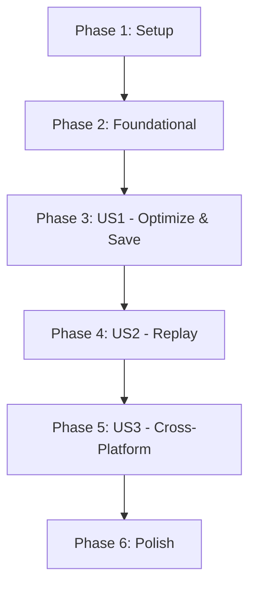

# Tasks: High-Reproducibility Tool Execution (Plan-Execute Optimization)

## Summary
Implement a high-reproducibility tool saving and replay system for Alice MK5. This involves tracking successful actions in a `clean_history`, filtering failed attempts, templatizing Robot scripts with variables based on data lineage, and executing saved tools via a dedicated linear graph using a `Fixed_Step_Executor` node.

## Phase 1: Setup
- [x] T001 Initialize project structure for feature in specs/004-tool-repro-optimization/
- [x] T002 Create centralized Tool Catalog index at src/memory/tools/catalog.json
- [x] T003 Ensure directory structure exists for platform-specific tools at src/robots/tools/{web,application}/

## Phase 2: Foundational Components
- [x] T004 Implement LineageTracker utility to wrap dataStore updates in src/agents/common/lineage_tracker.js
- [x] T005 Implement ValidationService for environment and variable validation in src/services/validation_service.js
- [x] T006 Update StorageService to support tool snapshots, manifest generation, and catalog indexing in src/services/storage_service.js
- [x] T007 Implement PostProcessor for filtering clean history and templatizing scripts in src/lib/post_processor.js

## Phase 3: User Story 1 - Optimize and Save Automation Tool
**Goal**: Automatically generate a "clean" re-executable tool after a successful task.
**Independent Test**: Run a multi-step task, confirm `clean_history` contains only success steps, and verify saved tool structure.

- [x] T008 [US1] Update ManagerState to include `clean_history` and lineage data in src/agents/manager/state.js
- [x] T009 [US1] Integrate LineageTracker into Manager node execution cycle in src/agents/manager/nodes/executor.js
- [x] T010 [US1] Implement "Save Tool" logic in src/agents/manager/nodes/finalizer.js including user approval prompt
- [x] T011 [US1] Implement automatic templatization of Robot scripts based on lineage in src/lib/post_processor.js
- [x] T012 [P] [US1] Create unit tests for clean history accumulation in tests/unit/clean_history.test.js
- [x] T013 [P] [US1] Create unit tests for catalog and manifest generation in tests/unit/catalog_management.test.js

## Phase 4: User Story 2 - High-Reproducibility Tool Replay
**Goal**: Run a saved tool using a deterministic "Fixed Plan".
**Independent Test**: Load a saved tool, verify it executes via `Fixed_Step_Executor` without searching, and measure execution speed.

- [x] T014 [US2] Implement Fixed_Step_Executor node for direct Robot script execution in src/agents/manager/nodes/fixed_step_executor.js
- [x] T015 [US2] Implement dedicated `reproGraph` for linear tool replay in src/agents/manager/graph.js
- [x] T016 [US2] Add real-time console feedback for each step in src/agents/manager/nodes/fixed_step_executor.js
- [x] T017 [US2] Implement environment metadata validation before replay in src/services/validation_service.js
- [x] T018 [US2] Implement failure diagnosis capture (snapshots, DOM) during replay in src/agents/manager/nodes/fixed_step_executor.js
- [x] T019 [US2] Add execution history recording for tool runs in src/services/storage_service.js
- [x] T020 [US2] Ensure volatile dataStore handling for replay in src/agents/manager/graph.js
- [x] T021 [US2] Create integration tests for end-to-end tool creation and replay in tests/integration/tool_repro_optimization.test.js

## Phase 5: User Story 3 - Cross-Platform Unified Sequence
**Goal**: Support tools containing both Web and Application steps.
**Independent Test**: Save and replay a tool that searches a website then writes to a local file/app.

- [x] T022 [US3] Update decomposer to prioritize tool discovery using catalog.json in src/agents/manager/nodes/decomposer.js
- [x] T023 [US3] Verify unified JSON manifest handles multi-platform scripts in src/services/storage_service.js
- [x] T024 [US3] Add cross-platform scenario to integration tests in tests/integration/tool_repro_optimization.test.js

## Phase 6: Polish
- [x] T025 Refactor common logic between exploration and replay graphs
- [x] T026 Update README.md and documentation with tool usage guide
- [x] T027 Final performance verification against SC-001 (30% speedup)

## Dependency Graph

## Parallel Execution Opportunities
- [P] T012, T013 (Unit tests for US1)
- [P] Implementation of foundational services (T004-T007) once setup is done

## Implementation Strategy
1. **MVP (US1)**: Focus on capturing the clean history and saving a valid tool JSON + script snapshot.
2. **Deterministic Replay (US2)**: Implement the minimal graph to execute the saved tool.
3. **Robustness**: Add environment validation and diagnostic snapshots.
4. **Generalization (US3)**: Ensure multi-platform tools work seamlessly.
