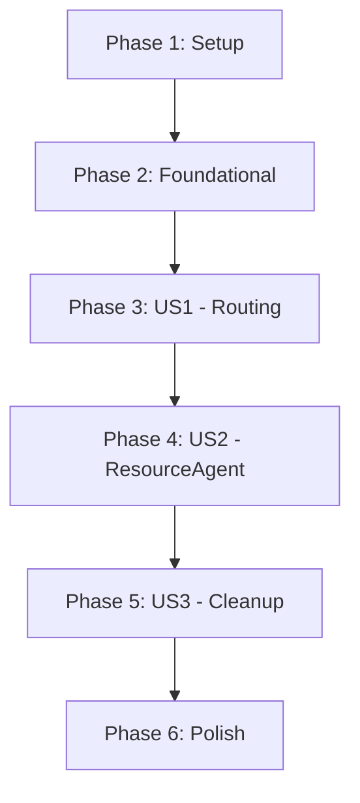

# Tasks: Robot Framework Resource Management Sub-Agent

## Summary
Implement a specialized `ResourceAgent` to manage Robot Framework `.resource` files. This feature replaces the one-off tool creation logic with a sustainable keyword-based extension model. The system will support intelligent routing, autonomous resource discovery, Diff-based user confirmation, and automated syntax validation.

## Phase 1: Setup
- [x] T001 Initialize project structure for feature in specs/005-manage-robot-resources/
- [x] T002 Ensure target directory for custom resources exists at src/robots/resources/custom/
- [x] T003 Ensure synonyms manifest exists at src/robots/resources/manifests.json

## Phase 2: Foundational Components
- [x] T004 [P] Implement RobotParser utility for reading/writing resource files in src/lib/robot_parser.js
- [x] T005 Implement ResourceService for indexing, backup, and dry-run validation in src/services/resource_service.js
- [x] T006 Update ManagerState to support ResourceAgent state transitions in src/agents/manager/state.js

## Phase 3: User Story 1 - Route to Resource Management
- [x] T007 [US1] Update router node to include intent classification for resource management in src/agents/manager/nodes/router.js
- [x] T008 [US1] Update Manager graph to include the ResourceAgent node and branching logic in src/agents/manager/graph.js
- [x] T009 [US1] Create unit tests for intent classification in tests/unit/router_classification.test.js

## Phase 4: User Story 2 - Add/Edit Robot Keywords
- [x] T010 [US2] Implement ResourceAgent node logic for resource modification in src/agents/manager/nodes/resource_agent.js
- [x] T011 [US2] Implement Diff-based UI for presenting changes to the user in src/agents/manager/nodes/resource_agent.js
- [x] T012 [US2] Integrate automated syntax validation (dry-run) into ResourceService in src/services/resource_service.js
- [x] T013 [US2] Implement automatic backup and restore logic in ResourceService in src/services/resource_service.js
- [x] T014 [US2] Implement manifests.json auto-update logic for synonyms in src/services/resource_service.js
- [x] T015 [P] [US2] Create unit tests for RobotParser keyword extraction and insertion in tests/unit/robot_parser.test.js
- [x] T016 [P] [US2] Create unit tests for ResourceService backup/restore functionality in tests/unit/resource_service.test.js

## Phase 5: User Story 3 - Removal of Tool Creation/Reuse
- [x] T017 [US3] Remove tool optimization and saving logic from Manager finalizer in src/agents/manager/nodes/finalizer.js
- [x] T018 [US3] Disable or remove reproGraph and FixedStepExecutor references in src/agents/manager/graph.js
- [x] T019 [US3] Clean up legacy tool directories and catalog if applicable in src/services/storage_service.js

## Phase 6: Polish
- [x] T020 Implement new resource file proposal and creation logic in ResourceAgent
- [x] T021 Refactor common agent utilities for better reuse between ResourceAgent and others
- [x] T022 Final end-to-end integration test for resource management in tests/integration/resource_management.test.js
- [x] T023 Update README.md with resource extension guide

## Dependency Graph

## Parallel Execution Opportunities
- [P] T004 (RobotParser) and T005 (ResourceService) initial setup
- [P] T015 and T016 (Unit tests for foundational logic)
- [P] T017 and T018 (Cleanup tasks) once foundational logic is verified

## Implementation Strategy
1. **Infrastructure**: Build the `RobotParser` and `ResourceService` to safely interact with files.
2. **Detection**: Update the `router` to enable the new flow.
3. **Execution**: Build the `ResourceAgent` with the full lifecycle (Index -> Select -> Propose -> Confirm -> Validate -> Save).
4. **Simplification**: Remove the legacy tool-based reproducibility paths.
